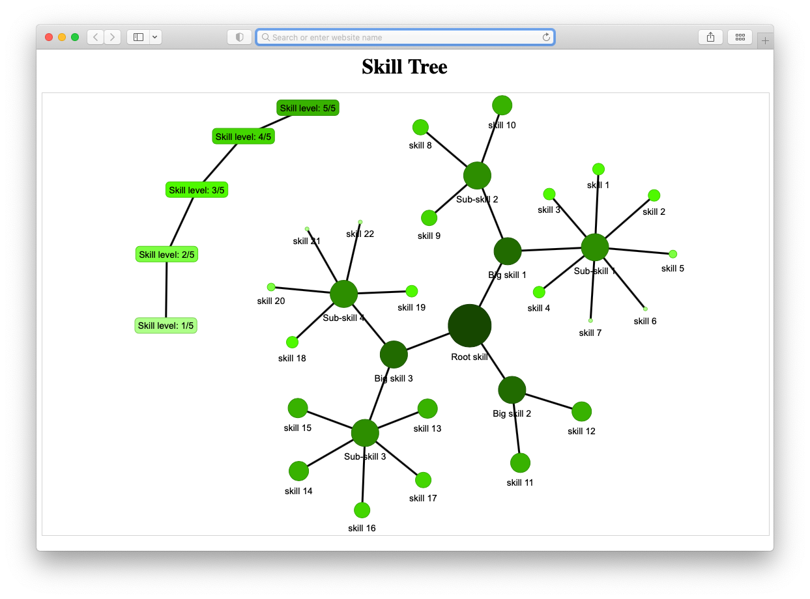

# SkillTree


*A simple **Skill tree** diagram creator.* Generated in [Python 3.10](https://www.python.org/) and visualised thanks to the Python module [Pyvis](https://pyvis.readthedocs.io/en/latest/). 


[View Demo](https://alexfloreslamas.github.io/pages/skill_tree.html)

---



---

## Installation and setup guide

- There's no installation procedure; please download the project and install the following dependencies:
  - [Python 3.10](https://www.python.org/)
  - [YAMl](https://pypi.org/project/PyYAML/)
  - [Pprint](https://pypi.org/project/pprintpp/)
  - [Networkx](https://networkx.org/documentation/stable/install.html)
  - [Pyvis](https://pypi.org/project/pyvis/)

---

## Usage

### Running the Python script

- Open the command-line interpreter and navigate to the folder `SkillTree/`
- Type the following command:


```terminal
python 3.10 main.py
```


In the above example, we call the `main.py` file with the information stored in the `SkillTree/Input/Skills.yml` file. The **HTML** file generated by the script is in the `SkillTree/Output` folder.


### The `SkillTree/Input/Skills.yml` file

This will file contain all the configurations and contents for your Skill Tree diagram. You can edit the **YML** file and replace the demo content with your own.

- The `network_config:` section includes all the information settings for visualising your skills.
- Below the **# Modify/Add skills below here** comment, you can add as many skills and sub-skills as needed; follow the pattern in the demo.

